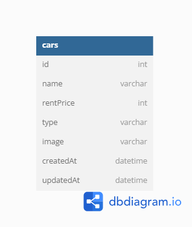

# FSW-Challange05

### Installation

1. Clone the repo
   ```sh
   git clone https://github.com/alreagon/FSW-Challange05.git
   ```
2. Install packages
   ```sh
   npm install
   ```
3. Next Step

   ```sh
   - setting config.js with your database, in my case i use xampp/mysql
   ```

4. Run
   ```sh
   npm start
   ```

# ERD



#Client Side

1. Halaman Index (GET) = http://localhost:8000/
2. Halaman Edit Car (POST) = http://localhost:8000/cars/update/:id
3. Halaman Create Car (POST) = http://localhost:8000/cars/create
4. Delete (GET) = http://localhost:8000/cars/delete/:id

#API Side

1. Create Car (POST) = http://localhost:8000/api/v1/cars
2. Read All Cars (GET) = http://localhost:8000/api/v1/cars
3. Update Car (PUT) = http://localhost:8000/api/v1/cars/:id
4. Delele Car (DELETE) = http://localhost:8000//api/v1/cars/:id
